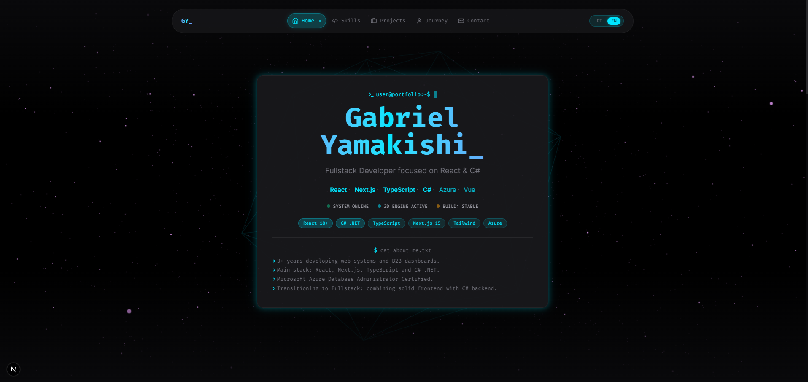

# 🚀 Portfólio 3D Interativo | Gabriel Yamakishi

<div align="center">
  
  
  [](https://nextjs.org/)
  [](https://www.typescriptlang.org/)
  [](https://react.dev/)
  [](https://threejs.org/)
  [](https://tailwindcss.com/)
  [](https://dotnet.microsoft.com/)
</div>

---

## 📖 Sobre o Projeto

Portfólio profissional interativo com renderização 3D, internacionalização PT/EN e arquitetura limpa seguindo princípios **SOLID** e **Clean Code**. Desenvolvido para demonstrar habilidades fullstack com foco em **React** e **C# .NET**.

### ✨ Features

- 🎨 **Renderização 3D** com Three.js e React Three Fiber
- 🌍 **Internacionalização** PT/EN com next-intl
- 📱 **Design Responsivo** mobile-first
- 🎬 **Player de Vídeo** integrado
- 📧 **Formulário de Contato** com Resend API
- 🎯 **Navegação Suave** com scroll spy
- 🌙 **Tema Escuro** estilo terminal/dashboard
- 🔒 **Projetos Privados** com placeholder profissional

---

## 🛠️ Stack Tecnológica

### Frontend


### Backend (Em evolução)


### Ferramentas


---

## 🏗️ Arquitetura
src/
├── app/ # Next.js App Router
│ ├── [lang]/ # Rotas internacionalizadas (pt/en)
│ └── api/ # API Routes (contato)
├── components/ # Componentes React (Atomic Design)
│ ├── ui/ # Átomos/Moléculas
│ ├── sections/ # Organismos (Hero, Skills, Projects, etc.)
│ ├── layout/ # Header, Footer
│ └── three/ # Componentes 3D
├── data/ # Camada de Dados
│ ├── mocks/ # Dados mockados
│ └── repositories/ # Padrão Repository
├── hooks/ # Custom Hooks
├── i18n/ # Internacionalização
│ ├── request.ts
│ └── routing.ts
├── lib/ # Utilitários e Configurações
│ ├── types.ts # Definições TypeScript
│ ├── constants.ts # Constantes
│ └── utils.ts # Funções helpers
└── messages/ # Arquivos de Tradução
├── pt.json
└── en.json

text

### Princípios Aplicados

| Princípio | Aplicação |
|-----------|-----------|
| **S - Single Responsibility** | Cada componente tem uma única responsabilidade |
| **O - Open/Closed** | Repositórios abertos para extensão, fechados para modificação |
| **L - Liskov Substitution** | Interfaces bem definidas |
| **I - Interface Segregation** | Hooks com responsabilidades específicas |
| **D - Dependency Inversion** | Componentes dependem de abstrações |

---

## 🚀 Como Rodar Localmente

### Pré-requisitos

- Node.js 18+
- npm 9+

### Instalação

```bash
# Clone o repositório
git clone https://github.com/yamakishi/portfolio-2026.git

# Entre na pasta
cd portfolio-2026

# Instale as dependências
npm install

# Configure as variáveis de ambiente
cp .env.example .env.local
# Edite .env.local com suas chaves

# Rode o projeto
npm run dev
Acesse http://localhost:3000

Variáveis de Ambiente
env
# Opcional - Para enviar emails pelo formulário de contato
RESEND_API_KEY=sua_chave_aqui
📂 Projetos em Destaque
🔒 WiseHome Dashboard
Dashboard de automação residencial IoT (código proprietário)

Stack: React, TypeScript, Node.js, SQL Server, Azure

Status: Em produção

📊 E-commerce Analytics
Dashboard analítico para e-commerce

Stack: React, TypeScript, Recharts, Tailwind CSS, Vite

Demo: Ver preview

📫 Contato
Email: gabriel.yamakishi@gmail.com

LinkedIn: linkedin.com/in/gabriel-yamakishi

GitHub: github.com/yamakishi

Portfólio: yamakishi.dev

📜 Licença
Este projeto está sob a licença MIT. Veja o arquivo LICENSE para mais detalhes.

<div align="center"> <p>Construído com 💙 por Gabriel Yamakishi</p> <p>React • Next.js • TypeScript • C# • Azure</p> </div> ```